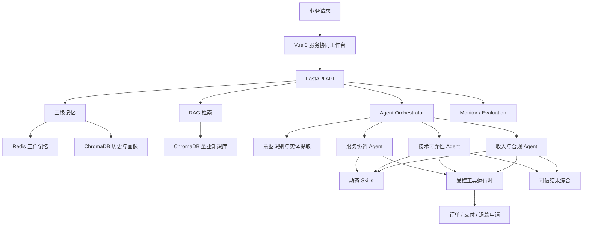

# 知应 AI｜企业服务协同 Agent 平台

> 让专业 Agent 在企业知识、权限边界和人工审核机制下，协同处理复杂业务请求。

[](https://github.com/mhn0207/ZhiYingAI/actions/workflows/ci.yml)


知应 AI 是一个面向企业服务场景的多 Agent 协同平台，统一处理业务咨询、技术支持、订单、支付和退款等复杂请求。项目基于 FastAPI、Vue 3 与大语言模型，将多轮记忆、意图识别、Agent 路由、RAG 企业知识库、受控工具调用、在线监控和自动评测整合为一条可治理的服务协同链路。

项目重点不是让单个模型完成一问一答，而是让不同专业 Agent 基于可追踪事实协作：只调用被授权的工具，明确区分建议与已执行操作，在证据冲突或高风险写入时交由人工确认。


## 核心能力

- **多 Agent 协作**：按意图路由到服务协调、技术可靠性或收入与合规 Agent，技术与账务复合问题支持并行处理。
- **三路意图识别**：融合 LLM 语义理解、本地向量匹配和关键词规则，并提取订单号、金额、日期和错误码等实体。
- **RAG 知识库**：支持查询改写、并行召回、结果去重、LLM 重排和 Top-K 返回。
- **三级记忆**：使用 Redis 保存当前会话，使用 ChromaDB 保存情景记忆和用户画像。
- **受控工具调用**：内置权限、Pydantic Schema、超时、缓存、熔断、幂等、降级和脱敏审计。
- **动态 Skills**：根据 Agent 类型和关键词注入业务 SOP，修改后可在运行时热加载。
- **可信结果综合**：工具事实优先于模型推断；多 Agent 结果支持去重、冲突检测、部分失败和人工审核标记。
- **监控与评测**：提供 Prometheus 指标、异常检测、Webhook 告警、LLM-as-Judge 和 RAG 检索评测。

## 系统架构



一次 `/chat` 请求会经过以下链路：

1. 从 Redis 和 ChromaDB 获取当前会话、相关历史与用户画像。
2. 对需要业务知识的问题执行查询改写、并行召回和结果重排。
3. 识别主意图、紧急程度以及订单号、金额、错误码等实体。
4. 路由到专业 Agent；技术与账务复合问题会并行处理。
5. 注入匹配的 Skills，并按角色权限调用业务工具。
6. 对多 Agent 结果进行事实去重、冲突检测和统一表达。
7. 写回会话记忆，并在后台异步更新用户画像。

## 演示场景

使用以下请求可以同时展示意图识别、RAG、多 Agent 并行、原生 Tool Calling 和结果综合：

```text
订单 A123 登录提示 401，而且被重复扣款 99 元，请帮我处理并申请退款。
```

预期链路：

```text
请求理解
  ├─ 技术可靠性 Agent：给出 401 的排查与验证步骤
  └─ 收入与合规 Agent
       ├─ get_order_status
       ├─ query_payment
       └─ create_refund_request → pending_review
            ↓
       结果综合：汇总已核实事实，标记退款仍需人工审核
```

内置 Mock 数据中，订单 `A123` 有两笔 99 元成功支付，可重复演示重复扣款核验和退款申请幂等。

## 技术栈

| 层级 | 技术 |
|---|---|
| 前端 | Vue 3、Vite |
| API | FastAPI、Uvicorn、Pydantic 2 |
| LLM | Anthropic SDK、LangChain Anthropic |
| 数据 | Redis、ChromaDB |
| 可观测性 | Prometheus Client、Webhook |
| 部署 | Docker Compose、Nginx |

## 快速开始

### Docker Compose

要求：Docker、Docker Compose，以及可用的 Anthropic API Key 或兼容服务。

```bash
cp .env.example .env
# 编辑 .env，至少填写 ANTHROPIC_API_KEY
docker compose up --build
```

Windows PowerShell：

```powershell
Copy-Item .env.example .env
# 编辑 .env，至少填写 ANTHROPIC_API_KEY
docker compose up --build
```

启动后可访问：

| 服务 | 地址 |
|---|---|
| 服务协同工作台 | <http://localhost> |
| FastAPI | <http://localhost:8000> |
| Swagger | <http://localhost:8000/docs> |
| Prometheus | <http://localhost:9090> |

`.env` 已被 Git 忽略，请勿提交真实密钥。生产环境还应覆盖示例 Redis 密码。

### 本地开发

后端需要 Python 3.12 和可访问的 Redis。ChromaDB 服务不可用时会回退到本地持久化目录。

```powershell
py -3.12 -m venv .venv
.\.venv\Scripts\python.exe -m pip install -r requirements.txt
.\.venv\Scripts\python.exe -m uvicorn api.main:app --reload
```

另开终端启动前端：

```bash
cd frontend
npm ci
npm run dev
```

前端开发地址为 <http://localhost:5173>，Vite 会将 `/api/zhiying/*` 代理到本地后端。

## API

| 方法 | 路径 | 说明 |
|---|---|---|
| `GET` | `/health` | 服务与 Agent 状态 |
| `POST` | `/chat` | 复杂业务请求统一入口 |
| `POST` | `/search` | 查询改写、召回与重排 |
| `POST` | `/knowledge/add` | 批量导入知识 |
| `POST` | `/knowledge/upload` | 上传 `.txt`、`.md` 或 `.json` 文件 |
| `GET` | `/knowledge/stats` | 知识库分片统计 |
| `GET` | `/skills` | 已加载的 Skills |
| `POST` | `/skills/reload` | 热加载 Skills |
| `GET` | `/tools` | 工具目录、权限、风险和统计 |
| `GET` | `/tools/executions` | 最近的脱敏工具轨迹 |
| `GET` | `/monitor` | Agent、工具、结构化输出和 RAG 状态 |
| `GET` | `/metrics` | Prometheus 指标 |
| `POST` | `/eval/run` | 意图与回答质量评测 |
| `POST` | `/eval/rag` | 新旧 RAG 对比评测 |

对话示例：

```bash
curl -X POST http://localhost:8000/chat \
  -H "Content-Type: application/json" \
  -d '{
    "message": "订单 A123 登录提示 401，而且被重复扣款了，请帮我处理。",
    "user_id": "demo-user"
  }'
```

首次请求会返回 `conv_id`。后续传回相同 ID，即可继续使用当前会话记忆。

## 受控工具与安全边界

| 工具 | 允许角色 | 风险 | 行为 |
|---|---|---|---|
| `get_order_status` | 服务协调 / 技术可靠性 / 收入与合规 | 只读 | 查询订单状态、商品和金额 |
| `query_payment` | 收入与合规 | 只读 | 查询支付记录并检测重复成功扣款 |
| `create_refund_request` | 收入与合规 | 中风险写入 | 创建 `pending_review` 申请，不执行真实退款 |

工具运行时会先校验 Agent 身份和参数，再执行超时、熔断、缓存、审计与失败降级。`POST /chat` 的 `tool_calls` 返回本轮轨迹；`GET /tools/executions` 提供最近的脱敏执行记录。

复合请求不会简单拼接多个回答。系统会把工具输出转换为可追踪事实，并遵循以下规则：

- 工具结果优先于知识库假设和模型推断。
- 相同事实使用稳定键去重。
- 同级可信来源冲突时阻断高风险操作并要求人工确认。
- 单个 Agent 失败时保留其他有效结果，并明确标记部分降级。
- 待审核申请不会被描述成已经执行成功。

## Skills 与灰度演进

内置 Skills 位于 `skills/*/SKILL.md`：

- `service_coordination`：业务承接、信息澄清、跨域分流和人工升级。
- `technical_support`：故障排查、错误诊断、配置指导和升级条件。
- `billing_support`：支付核验、退款申请、发票、订阅和合规边界。

修改 Skill 后调用 `POST /skills/reload` 即可热加载。

结构化输出与新版 LangChain RAG 默认关闭，可独立灰度：

```env
ZHIYING_LANGCHAIN_STRUCTURED_OUTPUT=false
ZHIYING_STRUCTURED_OUTPUT_MODE=tool
ZHIYING_STRUCTURED_OUTPUT_FALLBACK=true
ZHIYING_STRUCTURED_OUTPUT_SHADOW=false

ZHIYING_LANGCHAIN_RAG=false
ZHIYING_RAG_ROLLOUT_MODE=legacy
ZHIYING_RAG_CANARY_PERCENT=0
```

RAG 支持 `legacy`、`shadow`、`canary` 和 `langchain` 四种模式。推荐按 `legacy → shadow → 小流量 canary → langchain` 演进，新链路失败时可自动回退旧实现。

## 项目结构

```text
ZhiYing/
├── agents/       Agent 定义、路由、并行协作与结果综合
├── api/          FastAPI 应用入口和 HTTP API
├── core/         意图识别、Skills 和结构化输出
├── evaluation/   意图、回答质量和 RAG 评测
├── frontend/     Vue 3 服务协同工作台
├── mcp/          内部工具运行时与旧版知识库
├── memory/       Redis + ChromaDB 三级记忆
├── monitor/      指标、异常检测和告警
├── rag/          LangChain RAG 与灰度路由
├── skills/       可热加载的业务处理规范
├── tests/        单元与集成测试
├── config/       Nginx 与 Prometheus 配置
└── docker-compose.yml
```

> `mcp/` 当前是项目内部的工具管理抽象，并非完整的标准 MCP Server/Client 实现。

## 测试与验证

```powershell
# 72 个后端测试
.\.venv\Scripts\python.exe -m unittest discover -s tests -v

# Python 依赖与语法
.\.venv\Scripts\python.exe -m pip check
.\.venv\Scripts\python.exe -m compileall -q agents api core evaluation mcp memory monitor rag tests

# 前端生产构建
Set-Location frontend
npm ci
npm run build

# Docker Compose 配置
Set-Location ..
docker compose config --quiet
```

测试覆盖 API 契约、意图融合、实体提取、工具权限与幂等、多步 Tool Calling、多 Agent 冲突综合、结构化输出、记忆并发、RAG 切片与导入、灰度、失败回退和检索评测。GitHub Actions 会在 push 和 pull request 时自动运行后端测试及前端生产构建。

## 当前边界

- 订单、支付和退款目前使用可重复演示的内存 Mock 数据。
- 人工升级会返回升级标记，但尚未接入真实工单系统。
- API 暂未实现认证、租户隔离和细粒度授权，生产部署前必须补充鉴权与安全策略。
- 每种专业 Agent 当前只有一个实例，性能路由主要为后续水平扩展预留。
- 首次使用本地 Chroma Embedding 时可能需要下载 `all-MiniLM-L6-v2` ONNX 模型。

## License

本项目采用 [MIT License](LICENSE)。
