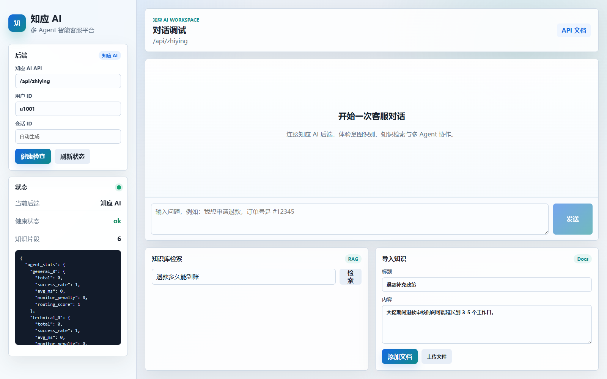
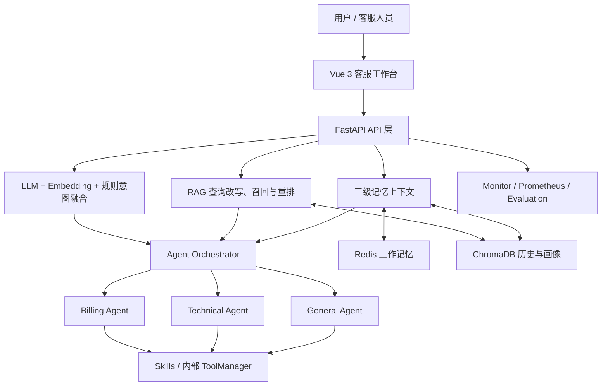
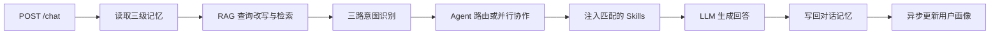

# 知应 AI｜多 Agent 智能客服平台

[](https://github.com/mhn0207/ZhiYingAI/actions/workflows/ci.yml) 

知应 AI 是一个面向智能客服场景的全栈 AI 平台。后端基于 FastAPI 和 Anthropic API，前端采用 Vue 3 + Vite，组合了多轮对话记忆、意图识别、多 Agent 路由、RAG 知识库、可热加载 Skills、在线监控和自动评测。

当前版本为 `2.0.0`，既保留原有 ChromaDB 检索与 JSON 输出链路，也提供可灰度启用的 LangChain 结构化输出和新版 RAG。



## 核心能力

- 三路意图识别：LLM、Embedding/本地向量和关键词规则加权融合
- 多 Agent 路由：通用客服、技术支持、账单退款和人工升级标记
- 复合问题协作：技术与账单问题可并行交给多个 Agent
- 三级记忆：Redis 工作记忆、ChromaDB 情景记忆和用户画像
- RAG 检索：查询改写、并行召回、去重、LLM 重排和 Top-K 返回
- 动态 Skills：按关键词与 Agent 类型注入业务规则，支持热加载
- 稳定性保护：缓存、超时、熔断、降级和旧实现回退
- 在线监控：成功率、延迟、异常检测、Prometheus 指标和 Webhook 告警
- 自动评测：意图准确率、Macro-F1、LLM-as-Judge、RAG Recall@K 和回归检测

## 系统架构



`mcp/` 目前是内部工具管理层，标准 MCP Server/Client 接入属于下一阶段演进方向，README 不把它包装成已经完成的能力。

## 请求链路



一次 `/chat` 请求的主要步骤：

1. 从 Redis 读取当前会话，从 ChromaDB 获取相关历史和用户画像。
2. 对需要业务知识的问题执行查询改写、向量检索和结果重排。
3. 识别意图、紧急程度及订单号、日期、金额、错误码等实体。
4. 将请求路由到 General、Technical 或 Billing Agent。
5. 把记忆、知识库结果、实体和匹配的 Skill 注入模型上下文。
6. 保存本轮消息，并在后台更新用户画像。

## 演示流程

推荐用一个同时包含技术和账单问题的请求展示完整链路：`订单 A123 登录提示 401，而且被重复扣款 99 元，请帮我处理。`

| 步骤 | 系统动作 | 可观察结果 |
|---|---|---|
| 1 | 工作台调用 `POST /chat` | 返回会话 ID、延迟和是否使用知识库 |
| 2 | 提取订单号、错误码、金额等实体 | 监控数据中可查看意图与路由结果 |
| 3 | 识别复合意图 | Technical 与 Billing Agent 并行处理各自子问题 |
| 4 | 召回排障与退款知识并注入匹配 Skill | 回答包含业务依据，不只依赖模型常识 |
| 5 | 聚合两个 Agent 的结果 | 一次响应同时给出 401 排查和重复扣款处理建议 |
| 6 | 写回 Redis 与 ChromaDB | 使用相同 `conv_id` 追问时保留上下文 |

演示时可同时打开工作台、Swagger `/docs` 和 `/monitor`，分别展示产品界面、API 契约与可观测性。

## 技术栈

- Python 3.12
- FastAPI、Uvicorn、Pydantic 2
- Anthropic Python SDK
- LangChain Core、LangChain Anthropic、LangChain Chroma
- Redis
- ChromaDB 0.5
- Prometheus Client
- Vue 3、Vite
- Docker Compose、Nginx、Prometheus

## 目录结构

```text
ZhiYing/
├── .github/        GitHub Actions 持续集成
├── agents/         Agent 定义、路由、并行协作和降级
├── api/            FastAPI 应用入口和 HTTP API
├── core/           意图识别、Skill 加载、结构化输出
├── docs/images/    README 界面截图
├── evaluation/     意图、对话质量和 RAG 评测
├── frontend/       Vue 3 客服工作台和前端 Nginx 配置
├── mcp/            内部工具管理器和旧版知识库
├── memory/         Redis + ChromaDB 三级记忆
├── monitor/        在线指标、异常检测和告警
├── rag/            LangChain RAG、Retriever 和灰度路由
├── skills/         可热加载的客服业务规范
├── tests/          单元测试和集成测试
├── config/         Nginx、Prometheus 配置
├── Dockerfile
├── LICENSE
└── docker-compose.yml
```

> `mcp/` 当前主要是项目内部的工具注册、调用、缓存和熔断抽象，并不是一个完整的标准 MCP Server/Client 实现。

## 快速开始

### 1. 准备配置

复制安全的配置模板：

```powershell
Copy-Item .env.example .env
```

Linux/macOS：

```bash
cp .env.example .env
```

然后编辑 `.env`，至少填写 `ANTHROPIC_API_KEY`，并在 Docker Compose 或生产环境中设置强 `REDIS_PASSWORD`。`.env` 已被 `.gitignore` 排除；只提交不含真实凭据的 `.env.example`。

### 2. 使用 Docker Compose 启动

```bash
docker compose up --build
```

Compose 会启动：

| 服务 | 默认访问地址 | 用途 |
|---|---|---|
| 知应 AI 后端 | `http://localhost:8000` | FastAPI 应用 |
| 知应 AI 前端 | `http://localhost:5174` | Vue 客服工作台直连入口 |
| Swagger | `http://localhost:8000/docs` | API 文档与调试 |
| Nginx | `http://localhost` | 前后端统一入口 |
| ChromaDB | `http://localhost:8001` | 向量数据库 |
| Redis | `localhost:6379` | 工作记忆 |
| Prometheus | `http://localhost:9090` | 指标采集 |

查看日志：

```bash
docker compose logs -f zhiying
```

停止服务：

```bash
docker compose down
```

如需同时移除持久卷，请先确认其中的数据不再需要，再执行 `docker compose down -v`。

### 3. 本地 Python 启动

本地运行前需要准备可访问的 Redis。ChromaDB 服务不可用时，程序会尝试使用本地持久化目录。

Windows PowerShell：

```powershell
py -3.12 -m venv .venv
.\.venv\Scripts\python.exe -m pip install -r requirements.txt
.\.venv\Scripts\python.exe -m uvicorn api.main:app --host 0.0.0.0 --port 8000 --reload
```

Linux/macOS：

```bash
python3.12 -m venv .venv
./.venv/bin/python -m pip install -r requirements.txt
./.venv/bin/python -m uvicorn api.main:app --host 0.0.0.0 --port 8000 --reload
```

也可以运行交互式 CLI：

```bash
python api/main.py --cli
```

### 4. 本地前端启动

后端在 `localhost:8000` 运行后，另开终端执行：

```bash
cd frontend
npm ci
npm run dev
```

访问 `http://localhost:5173`。Vite 会将 `/api/zhiying/*` 代理到本地后端。

## API 示例

### 对话

```bash
curl -X POST http://localhost:8000/chat \
  -H "Content-Type: application/json" \
  -d '{
    "message": "订单 12345 登录报错，而且被重复扣款了",
    "user_id": "demo-user"
  }'
```

响应示例：

```json
{
  "conv_id": "generated-conversation-id",
  "request_id": "generated-request-id",
  "response": "...",
  "intent": "technical",
  "agent_type": "technical",
  "escalated": false,
  "latency_ms": 1234.5,
  "knowledge_used": true
}
```

后续对话传回相同的 `conv_id`，即可继续使用当前会话记忆。

### 搜索知识库

```bash
curl -X POST "http://localhost:8000/search?query=退款多久到账&top_k=5"
```

### 导入知识

```bash
curl -X POST http://localhost:8000/knowledge/add \
  -H "Content-Type: application/json" \
  -d '{
    "documents": [
      {
        "title": "退款政策",
        "content": "退款申请通过后，款项通常按原支付路径退回。"
      }
    ]
  }'
```

也可以通过 `/knowledge/upload` 上传 UTF-8 编码的 `.txt`、`.md` 或 JSON 数组文件，单个文件上限为 10 MB。

### 主要接口

| 方法 | 路径 | 说明 |
|---|---|---|
| `GET` | `/health` | 服务与 Agent 状态 |
| `POST` | `/chat` | 主对话接口 |
| `POST` | `/search` | 查询改写、召回和重排 |
| `POST` | `/knowledge/add` | 批量导入知识 |
| `POST` | `/knowledge/upload` | 上传知识文件 |
| `GET` | `/knowledge/stats` | 知识库分片统计 |
| `GET` | `/skills` | 已加载的 Skills |
| `POST` | `/skills/reload` | 热加载 Skills |
| `GET` | `/tools` | 业务工具、风险级别、Agent 权限和运行统计 |
| `GET` | `/tools/executions` | 脱敏后的最近工具调用轨迹 |
| `GET` | `/monitor` | Agent、工具、结构化输出和 RAG 统计 |
| `GET` | `/metrics` | Prometheus 指标 |
| `POST` | `/eval/run` | 意图与对话质量评测 |
| `POST` | `/eval/rag` | 新旧 RAG 双后端评测 |

## 业务 Tool Calling

General、Technical 和 Billing Agent 会获得各自允许使用的 Anthropic 原生工具定义。模型选择工具和参数后，系统执行权限校验、Pydantic Schema 校验、超时、熔断、缓存和审计，再把 `tool_result` 返回模型生成最终回答。

| 工具 | 权限 | 风险 | 说明 |
|---|---|---|---|
| `get_order_status` | General / Technical / Billing | 只读 | 查询订单状态、商品和金额 |
| `query_payment` | Billing | 只读 | 查询支付记录并检测重复成功扣款 |
| `create_refund_request` | Billing | 中风险写入 | 只创建 `pending_review` 退款申请，不执行真实退款 |

内置可重复 Mock 场景：订单 `A123` 有两笔 99 元成功支付。请求：

```text
订单 A123 被重复扣款了，请帮我退款。
```

预期工具轨迹：

```text
BillingAgent
  → get_order_status
  → query_payment
  → create_refund_request
  → 返回 pending_review，等待人工审核
```

`POST /chat` 的 `tool_calls` 字段会返回本次轨迹；`GET /tools/executions` 可查看最近的脱敏审计记录。单请求最大调用步数和总超时由环境变量控制。

## 多 Agent 结构化结果综合

复合请求会并行派发给 Technical 和 Billing Agent。每个响应先转换为
`AgentWorkResult`，再由 `SynthesisAgent` 统一处理，不再直接拼接字符串：

1. 工具返回值进入 `confirmed_facts`，模型文本只能作为处理建议。
2. 相同事实按稳定键去重，工具结果优先于知识库和模型推断。
3. 同级可信来源不一致时生成 `conflicts`，订单、支付和退款冲突会触发人工确认。
4. 单个 Agent 失败时保留其他有效结果，并在回答中明确标记部分降级。
5. 退款申请只标记为 `requires_approval`，不会被描述成已经完成退款。

`POST /chat` 在复合请求下额外返回 `synthesis`：

- `confirmed_facts`：经过来源分级和去重的事实
- `conflicts`：冲突候选、是否阻断及处理规则
- `partial_failure`：是否有 Agent 处理失败
- `requires_approval` / `requires_human`：审核与人工介入信号
- `agents`：参与综合的 Agent 及其事实、工具调用数量


## Skills

内置 Skill 位于 `skills/*/SKILL.md`：

- `general_customer_service`：通用接待、信息澄清和分流
- `technical_support`：故障排查、错误诊断和升级规则
- `billing_support`：扣款、退款、发票和订阅规范

Skill 使用简单的 front matter 配置：

```markdown
---
name: 技术支持处理规范
description: 技术故障排查规则
keywords: 报错,错误,500,登录失败
agents: technical
enabled: true
---
# 技术支持处理规范
这里填写需要注入 Agent system prompt 的业务规则。
```

修改后调用以下接口即可热加载：

```bash
curl -X POST http://localhost:8000/skills/reload
```

## LangChain 结构化输出

结构化输出默认关闭。启用后，意图识别、查询改写、结果重排、用户画像和 LLM Judge 会使用严格的 Pydantic Schema。

```env
ZHIYING_LANGCHAIN_STRUCTURED_OUTPUT=true
ZHIYING_STRUCTURED_OUTPUT_MODE=tool
ZHIYING_STRUCTURED_OUTPUT_FALLBACK=true
ZHIYING_STRUCTURED_OUTPUT_SHADOW=false
ZHIYING_STRUCTURED_OUTPUT_VALIDATION_RETRIES=1
ZHIYING_LLM_TIMEOUT=30
ZHIYING_LLM_MAX_RETRIES=2
```

可用模式：

- `tool`：通过 tool calling 获取结构化结果，当前推荐模式
- `native`：原生 JSON Schema；当前锁定的 `langchain-anthropic` 版本不支持时会降级
- `legacy_json`：使用原来的 JSON Prompt 和集中式解析

`ZHIYING_STRUCTURED_OUTPUT_SHADOW=true` 时会并行执行新旧实现、记录差异，但优先返回旧结果。

## RAG 灰度与回滚

LangChain RAG 默认关闭，旧 collection `knowledge_base` 会继续工作。

```env
ZHIYING_LANGCHAIN_RAG=false
ZHIYING_RAG_ROLLOUT_MODE=legacy
ZHIYING_RAG_CANARY_PERCENT=0
ZHIYING_KB_COLLECTION=knowledge_base_langchain
ZHIYING_EMBEDDING_PROVIDER=chroma_default
ZHIYING_EMBEDDING_MODEL=all-MiniLM-L6-v2
ZHIYING_EMBEDDING_DIMENSIONS=384
ZHIYING_RAG_CHUNK_SIZE=500
ZHIYING_RAG_CHUNK_OVERLAP=80
ZHIYING_RAG_MAX_CONCURRENCY=4
```

| 模式 | 读取 | 写入 | 对外返回 |
|---|---|---|---|
| `legacy` | 旧索引 | 旧索引 | 旧结果 |
| `shadow` | 新旧双读 | 新旧双写 | 默认旧结果 |
| `canary` | 新旧双读 | 新旧双写 | 按查询哈希稳定分流 |
| `langchain` | 新索引优先 | 新旧双写 | 新结果，失败回退旧结果 |

推荐按 `legacy → shadow → 5%/25%/50%/100% canary → langchain` 的顺序发布。切流前可调用 `POST /eval/rag` 对比 Recall@1/3/5 和 MRR。

快速回滚：

```env
ZHIYING_LANGCHAIN_STRUCTURED_OUTPUT=false
ZHIYING_STRUCTURED_OUTPUT_SHADOW=false
ZHIYING_LANGCHAIN_RAG=false
ZHIYING_RAG_ROLLOUT_MODE=legacy
ZHIYING_RAG_CANARY_PERCENT=0
```

## 测试与验证

`.github/workflows/ci.yml` 会在每次 push 和 pull request 时自动执行后端测试、Python 依赖与语法检查，以及前端生产构建。

运行测试：

```powershell
.\.venv\Scripts\python.exe -m unittest discover -s tests -v
```

检查依赖和语法：

```powershell
.\.venv\Scripts\python.exe -m pip check
.\.venv\Scripts\python.exe -m compileall -q api core evaluation mcp memory monitor rag tests
docker compose config --quiet
```

当前仓库包含 72 个测试，覆盖 API 契约、意图融合、实体提取、业务工具权限与幂等、原生 Tool Calling、多 Agent 事实去重与冲突综合、结构化输出、RAG 切片与幂等、并发、灰度、回退和检索评测。

## 监控

`GET /monitor` 会返回：

- Agent 请求数、成功率、平均延迟和路由评分
- 工具成功率、P50/P95、连续失败数和熔断状态
- 结构化输出成功、校验失败、重试、fallback 和 shadow 差异
- RAG 新旧响应、双读失败、Top-1 一致率和 Top-K overlap
- 当前告警和路由优化建议

`GET /metrics` 暴露 Prometheus 格式指标。配置 `ALERT_WEBHOOK_URL` 后，阈值告警还会异步发送到指定 Webhook。

## 重要环境变量

| 变量 | 默认值 | 说明 |
|---|---|---|
| `ANTHROPIC_API_KEY` | 无 | 必填，LLM API Key |
| `ANTHROPIC_BASE_URL` | 官方地址 | 可选的兼容服务地址 |
| `ANTHROPIC_MODEL` | `claude-3-5-sonnet-20241022` | 使用的模型 |
| `REDIS_URL` | `redis://redis:6379/0` | 工作记忆 Redis |
| `CHROMA_HOST` | `chromadb` | ChromaDB 主机 |
| `CHROMA_PORT` | `8000` | ChromaDB 容器端口 |
| `CHROMA_PERSIST_DIRECTORY` | `/app/data/chroma` | 本地回退目录 |
| `ZHIYING_SKILLS_DIR` | `./skills` | Skill 根目录 |
| `ZHIYING_SKILLS_MAX_PROMPT_CHARS` | `5000` | 单次 Skill 注入总长度 |
| `ZHIYING_AGENT_TOOL_CALLING` | `true` | 是否启用 Agent 原生业务工具调用 |
| `ZHIYING_AGENT_MAX_TOOL_STEPS` | `4` | 单请求最大工具调用步数 |
| `ZHIYING_AGENT_REQUEST_TIMEOUT` | `60` | Agent 单请求总超时，秒 |
| `VITE_ZHIYING_API_URL` | `/api/zhiying` | 前端开发或构建时的 API 地址 |
| `ZHIYING_API_UPSTREAM` | `zhiying:8000` | 前端 Nginx 的后端服务地址 |
| `MONITOR_INTERVAL` | `10` | 监控采集周期，秒 |
| `ALERT_WEBHOOK_URL` | 空 | 告警 Webhook |
| `EVAL_BASELINE_PATH` | `/app/data/eval/baseline.json` | 评测基线文件 |
| `LOG_LEVEL` | `INFO` | 日志级别 |

## 当前边界

- 人工升级目前只设置 `escalated=true`，尚未连接真实工单系统。
- 每种专业 Agent 当前只有一个实例，性能路由主要用于后续水平扩展。
- API 暂未实现鉴权，CORS 允许所有来源；生产部署前应增加认证、权限和限流。
- 本地 Python 模式仍需要可用的 Redis。
- 用户画像会在每轮聊天后异步调用 LLM 更新，需要关注供应商限流、延迟和费用。
- 首次使用本地 Chroma Embedding 时可能需要下载 `all-MiniLM-L6-v2` ONNX 模型。
- 外部供应商的 tool calling 兼容性需要用真实部署环境做 smoke test。

## Copyright

Copyright (c) 2026 mhn0207. All rights reserved.
